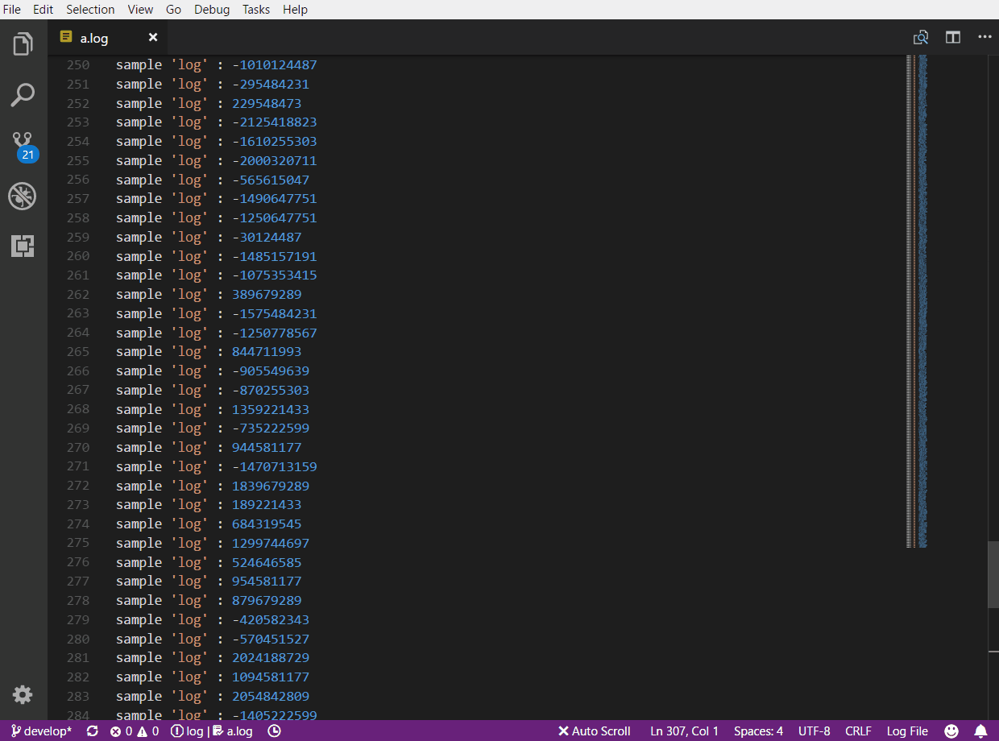

# AutoScroll README

This extension provides auto scroll to the end of files when files have been changes outside of vs code.
Something can be helpful in watching log files.

## Features

In the `.log` file this extension is enabled and in other files, you need press `F1` and type `Enable Auto Scroll` command to enable it.

In the status bar, you can activate or deactivate auto scrolling. it always shows you end of the file.

## Suggestions

For better log viewing you can install

https://marketplace.visualstudio.com/items?itemName=emilast.LogFileHighlighter

## Extension Settings

This extension contributes the following settings:

* `autoScroll.enable`: enable/disable this extension
* `autoScroll.toggle`: toggle enable/disable

## Release Notes

### 1.0.2

Fix not scrolling to end of file right after open it

### 1.0.1

Initial release
